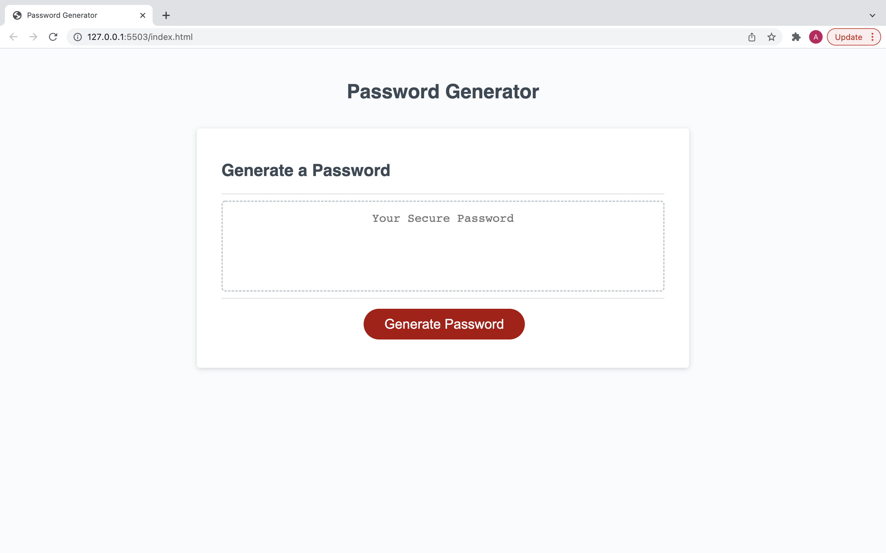
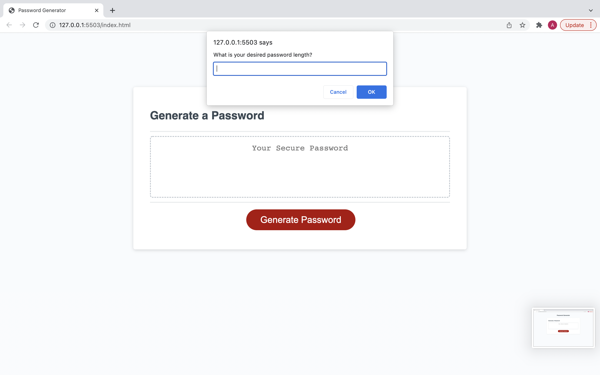
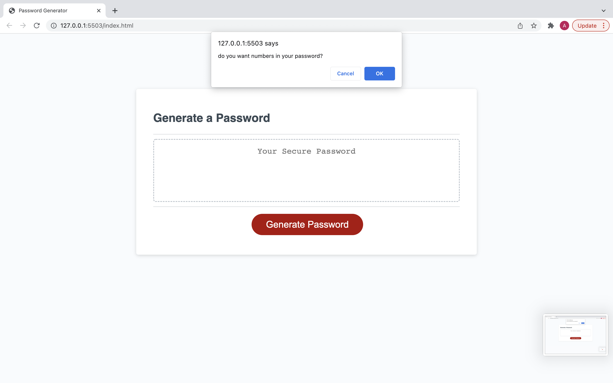
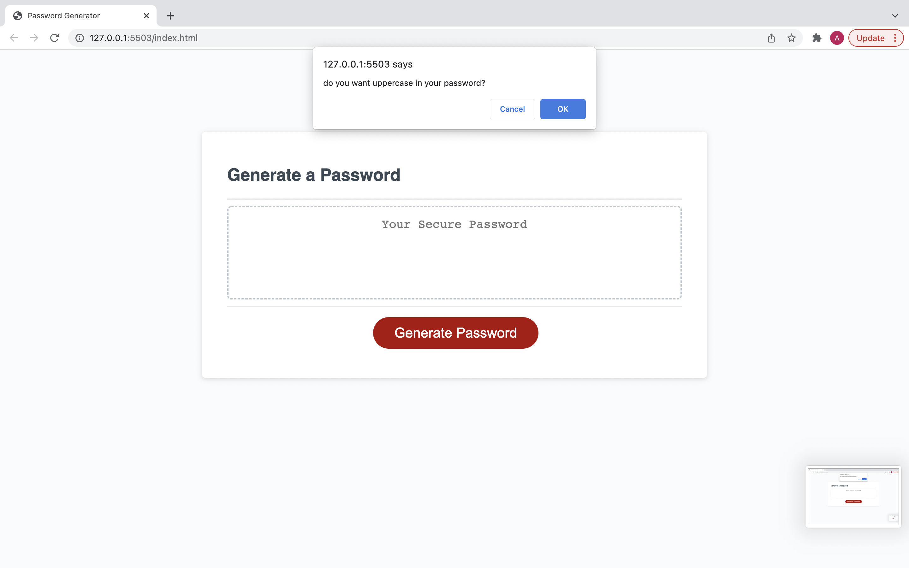
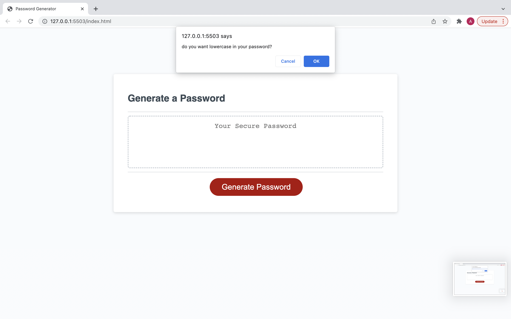
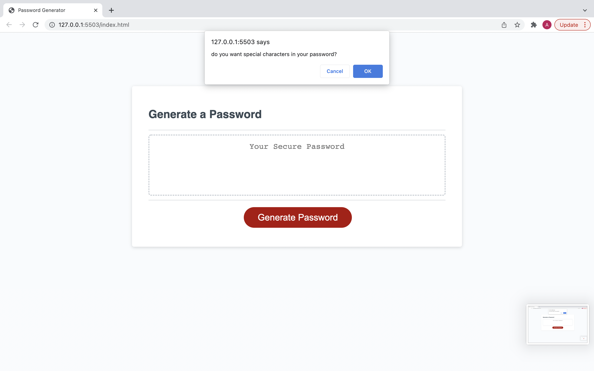
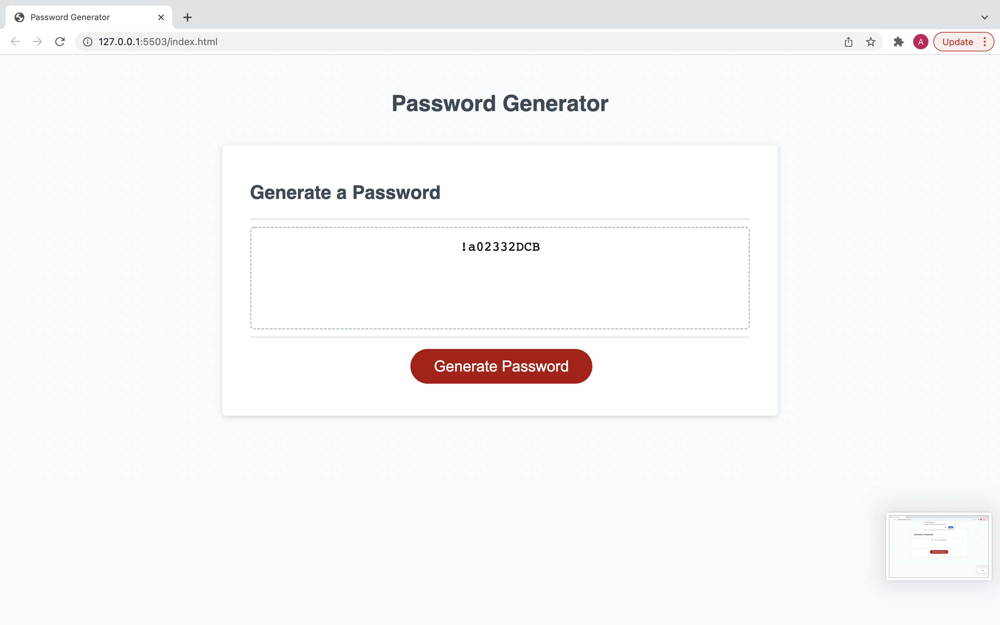
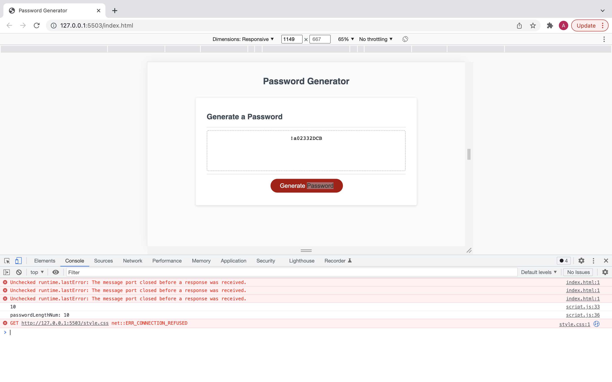

# password-generator

created a password generator using java-script.

# Task

This task had involved using functions , arrays and key java script concepts to create a password generator. The password generator's main function is to respond to a series of confirm boxes and prompts and generate a password.

# Deployed URL

[here](https://aosman0.github.io/password-generator/)

# Screenshots

# Technology Used

- Visual Studio Code
- JavaScript
- HTML
- GitHub
- Terminal
